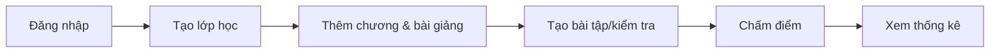
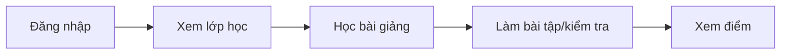

<div align="center">
  <h1>📚 LMS - Hệ Thống Quản Lý Học Tập</h1>
  <p><strong>Learning Management System</strong></p>
  
  <p>
    <a href="#tính-năng">Tính năng</a> •
    <a href="#demo">Demo</a> •
    <a href="#cài-đặt">Cài đặt</a> •
    <a href="#sử-dụng">Sử dụng</a> •
    <a href="#api">API</a> •
    <a href="#đóng-góp">Đóng góp</a>
  </p>

  <p>
    
    
    
    
  </p>
</div>

---

## 📖 Giới thiệu

Hệ thống quản lý học tập (LMS) là nền tảng e-learning hoàn chỉnh được xây dựng bằng **PHP thuần** và **JavaScript**, áp dụng kiến trúc **MVC** và **OOP** hiện đại. Dự án cung cấp giải pháp toàn diện cho việc giảng dạy và học tập trực tuyến với hai vai trò chính:

- 👨‍🏫 **Giảng viên**: Quản lý lớp học, tạo bài giảng, bài tập, kiểm tra và chấm điểm
- 👨‍🎓 **Sinh viên**: Học tập, làm bài tập, kiểm tra và theo dõi tiến độ

### 🎯 Điểm nổi bật

- ✅ **Không cần framework**: PHP thuần, dễ hiểu và tùy chỉnh
- ✅ **Kiến trúc rõ ràng**: MVC + Repository + Service Layer
- ✅ **Tự động chấm điểm**: Hệ thống trắc nghiệm tự động
- ✅ **Theo dõi tiến độ**: Real-time progress tracking
- ✅ **Responsive design**: Tương thích mọi thiết bị

---

## 📑 Mục lục

<details>
<summary>Xem mục lục chi tiết</summary>

- [Giới thiệu](#-giới-thiệu)
- [Tính năng](#-tính-năng)
- [Demo](#-demo)
- [Kiến trúc](#️-kiến-trúc)
- [Công nghệ](#-công-nghệ)
- [Cài đặt](#-cài-đặt)
- [Sử dụng](#-sử-dụng)
- [API Documentation](#-api-documentation)
- [Cơ sở dữ liệu](#-cơ-sở-dữ-liệu)
- [Roadmap](#-roadmap)
- [Đóng góp](#-đóng-góp)
- [License](#-license)
- [Liên hệ](#-liên-hệ)

</details>

---

## ✨ Tính năng

<table>
<tr>
<td width="50%">

### 👨‍🏫 Dành cho Giảng viên

#### 📊 Quản lý lớp học
- Tạo và quản lý nhiều lớp học
- Xem danh sách sinh viên
- Dashboard thống kê tổng quan

#### 📚 Quản lý nội dung
- Tạo và tổ chức chương học
- Upload bài giảng video
- Tạo bài tập văn bản
- Tạo bài kiểm tra trắc nghiệm

#### ✍️ Chấm điểm
- Xem bài làm sinh viên
- Chấm điểm và nhận xét
- Thống kê điểm theo chương
- Dashboard tiến độ nộp bài

#### 📎 Tài liệu & Thông báo
- Upload tài liệu (PDF, DOC, PPT)
- Gửi thông báo
- Trả lời bình luận

</td>
<td width="50%">

### 👨‍🎓 Dành cho Sinh viên

#### 🎓 Học tập
- Xem lớp học đã đăng ký
- Truy cập bài giảng video
- Theo dõi tiến độ học tập
- Lưu vị trí xem video

#### 📝 Bài tập
- Xem danh sách bài tập
- Làm và nộp bài online
- Xem điểm và nhận xét
- Kiểm tra deadline

#### 📋 Kiểm tra
- Làm bài trắc nghiệm
- Tự động chấm điểm
- Xem kết quả chi tiết
- Đếm ngược thời gian

#### 💯 Điểm số & Tài liệu
- Xem bảng điểm chi tiết
- Công thức: 10% CC + 40% BT + 50% KT
- Tải tài liệu học tập
- Bình luận và đặt câu hỏi

</td>
</tr>
</table>

---

## 🎬 Demo

### Screenshots

<details>
<summary>🖼️ Xem ảnh demo (Click để mở rộng)</summary>

#### Giao diện Giảng viên
- Dashboard tổng quan
- Quản lý lớp học
- Chấm điểm bài tập

#### Giao diện Sinh viên
- Trang chủ sinh viên
- Xem bài giảng video
- Làm bài kiểm tra trắc nghiệm
- Bảng điểm

</details>

### Live Demo

> **Lưu ý**: Demo đang trong quá trình triển khai

---

## 🏗️ Kiến trúc

### Tổng quan kiến trúc

Hệ thống được xây dựng theo mô hình **3-tier architecture** với các tầng rõ ràng:

```
┌─────────────────────────────────────────────────┐
│           PRESENTATION LAYER (Frontend)         │
│        HTML/CSS/JavaScript (Vanilla JS)         │
└─────────────────────────────────────────────────┘
                       │
                       ↓ REST API
┌─────────────────────────────────────────────────┐
│          APPLICATION LAYER (Backend)            │
│                                                 │
│  ┌──────────────┐  ┌──────────────┐            │
│  │ Controllers  │  │   Services   │            │
│  │   (MVC)      │→ │  (Business)  │            │
│  └──────────────┘  └──────────────┘            │
│                            ↓                    │
│                    ┌──────────────┐            │
│                    │ Repositories │            │
│                    │ (Data Access)│            │
│                    └──────────────┘            │
└─────────────────────────────────────────────────┘
                       │
                       ↓ PDO
┌─────────────────────────────────────────────────┐
│            DATA LAYER (Database)                │
│              MySQL Database                     │
└─────────────────────────────────────────────────┘
```

### Design Patterns

- **🔹 Singleton Pattern**: Database connection management
- **🔹 MVC Pattern**: Separation of concerns
- **🔹 Repository Pattern**: Data access abstraction
- **🔹 Service Layer Pattern**: Business logic isolation
- **🔹 DTO Pattern**: Data transfer objects (Models)

### Backend Structure (PHP OOP)

Hệ thống backend được tổ chức theo kiến trúc phân tầng rõ ràng:

```
backend/
├── co-so/              # Base classes (Foundation Layer)
│   ├── Database.php           # Singleton database connection
│   ├── BaseController.php     # Base controller với response helpers
│   ├── BaseService.php        # Base service với business logic
│   ├── BaseModel.php          # Base model với data sanitization
│   └── BaseRepository.php     # Base repository với database operations
│
├── dieu-khieu/         # Controllers
│   ├── GiangVienController.php   # Teacher endpoints
│   └── SinhVienController.php    # Student endpoints
│
├── dich-vu/           # Services (Business Logic Layer)
│   ├── BaiGiangService.php       # Lesson management
│   ├── BaiTapService.php         # Homework management
│   ├── BaiKiemTraService.php     # Quiz/Test management
│   ├── DiemService.php           # Grade management
│   ├── LopHocService.php         # Class management
│   ├── ThongKeService.php        # Statistics
│   └── ...
│
├── kho-du-lieu/       # Repositories (Data Access Layer)
│   ├── BaiGiangRepository.php
│   ├── BaiTapRepository.php
│   ├── SinhVienRepository.php
│   └── ...
│
├── mau/               # Models (Data Transfer Objects)
│   ├── BaiGiang.php
│   ├── BaiTap.php
│   ├── SinhVien.php
│   └── ...
│
├── student/api/       # Student API endpoints
│   ├── dang-nhap.php
│   ├── trang-chu-dashboard.php
│   ├── danh-sach-bai-hoc.php
│   ├── chi-tiet-bai-tap.php
│   ├── nop-bai-tap.php
│   └── ...
│
└── teacher/api/       # Teacher API endpoints
    ├── dang-nhap.php
    ├── danh-sach-lop-hoc.php
    ├── tao-bai-tap.php
    ├── cham-diem-cau-hoi.php
    └── ...
```

### Frontend Structure (Vanilla JavaScript)

```
public/
├── 🔐 Login.student.html     # Đăng nhập sinh viên
├── 🔐 Login.teacher.html     # Đăng nhập giảng viên
│
├── 👨‍🎓 student/              # Portal sinh viên
│   ├── Trang Chủ.html        # Dashboard
│   ├── Thông tin bài học.html
│   ├── Bài tập.html
│   ├── Bài kiểm tra.html
│   ├── Bảng điểm.html
│   ├── js/                   # JavaScript modules
│   │   ├── config/
│   │   ├── components/
│   │   └── *.js
│   └── CSS/
│
└── 👨‍🏫 teacher/              # Portal giảng viên
    ├── TrangChu.html         # Dashboard
    ├── Classroom.html        # Danh sách lớp
    ├── ClassroomInfo.html    # Chi tiết lớp
    ├── HomeWork.html         # Chi tiết bài tập
    ├── WorkDashBoard.html    # Dashboard chấm điểm
    ├── js/
    │   ├── config/          # Routes, API endpoints
    │   ├── cau-hinh/        # Constants
    │   └── components/       # Reusable UI
    └── CSS/
```

---

## 🛠️ Công nghệ

### Backend


### Frontend


### Tools & Environment


### Key Libraries & Features
- **Session Management**: PHP Sessions
- **Security**: Password hashing, PDO prepared statements
- **CORS**: Cross-Origin Resource Sharing configured
- **REST API**: JSON-based API endpoints

---

## 💾 Cơ sở dữ liệu

### Database Schema

Hệ thống sử dụng **MySQL 5.7+** với encoding **utf8mb4_unicode_ci**.

```sql
Database: lms_hoc_tap
Tables: 20+
Relationships: Foreign Keys with CASCADE
```

### Entity Relationship Diagram

```
┌─────────────┐       ┌──────────────┐       ┌─────────────┐
│  nguoi_dung │───────│   lop_hoc    │───────│   mon_hoc   │
└─────────────┘       └──────────────┘       └─────────────┘
      │                      │
      │                      │
      ├──────────────────────┴────────┐
      │                               │
┌─────────────┐                 ┌──────────┐
│   chuong    │─────────────────│bai_giang │
└─────────────┘                 └──────────┘
      │                               │
      ├───────────────┬───────────────┤
      │               │               │
┌──────────┐    ┌──────────┐   ┌──────────────┐
│ bai_tap  │    │bai_kiem  │   │tien_do_video │
└──────────┘    │   _tra   │   └──────────────┘
      │         └──────────┘
      │               │
┌──────────┐    ┌──────────────┐
│ bai_lam  │    │bai_lam_kiem  │
└──────────┘    │    _tra      │
                └──────────────┘
```

### Core Tables

<details>
<summary><b>👥 Quản lý người dùng</b></summary>

- **nguoi_dung**: Thông tin user (giảng viên, sinh viên)
  - Roles: `giang_vien`, `sinh_vien`
  - Authentication: Email + hashed password

</details>

<details>
<summary><b>🏫 Quản lý lớp học</b></summary>

- **mon_hoc**: Môn học
- **lop_hoc**: Lớp học cụ thể
- **sinh_vien_lop_hoc**: Đăng ký lớp
  - Constraint: 1 sinh viên chỉ học 1 lớp/môn

</details>

<details>
<summary><b>📚 Nội dung học tập</b></summary>

- **chuong**: Chương học
- **bai_giang**: Bài giảng video
- **tien_do_video**: Tracking video progress
- **tai_lieu**: Tài liệu đính kèm

</details>

<details>
<summary><b>📝 Bài tập & Kiểm tra</b></summary>

**Bài tập văn bản:**
- bai_tap
- cau_hoi_bai_tap
- bai_lam
- chi_tiet_tra_loi

**Kiểm tra trắc nghiệm:**
- bai_kiem_tra
- cau_hoi_trac_nghiem
- lua_chon_cau_hoi (A, B, C, D)
- bai_lam_kiem_tra
- chi_tiet_tra_loi_trac_nghiem

</details>

<details>
<summary><b>💬 Tương tác</b></summary>

- **thong_bao**: Thông báo
- **binh_luan_bai_giang**: Comment trên bài giảng
- **binh_luan_cau_hoi**: Comment trên câu hỏi bài tập
- **hoat_dong**: Activity logs

</details>

### Database Migrations

Các file SQL trong `backend/docs/`:
- `database_tables.sql` - Schema chính
- `sample.sql` - Dữ liệu mẫu
- `them-*.sql` - Feature updates
- `sua-*.sql` - Bug fixes
- `triggers.sql` - Database triggers

---

## 🚀 Cài đặt

### Yêu cầu hệ thống

```
PHP          >= 7.4
MySQL        >= 5.7
Apache/Nginx >= 2.4
PDO Extension   ✓
```

### Quick Start

#### 1️⃣ Clone Repository

```bash
git clone https://github.com/ThuHuong2299/LMS_PHP.git
cd LMS_PHP
```

#### 2️⃣ Cấu hình Database

```bash
# Tạo database
CREATE DATABASE lms_hoc_tap CHARACTER SET utf8mb4 COLLATE utf8mb4_unicode_ci;

# Import schema
mysql -u root -p lms_hoc_tap < backend/docs/database_tables.sql

# Import dữ liệu mẫu (optional)
mysql -u root -p lms_hoc_tap < backend/docs/sample.sql

# Import các updates (nếu có)
mysql -u root -p lms_hoc_tap < backend/docs/them-bai-kiem-tra-cuoi-chuong-1.sql
mysql -u root -p lms_hoc_tap < backend/docs/them-binh-luan-bai-giang.sql
# ... các file khác trong thư mục docs/
```

#### 3️⃣ Cấu hình kết nối

Chỉnh sửa file `backend/co-so/Database.php`:

```php
private $host = 'localhost';
private $dbname = 'lms_hoc_tap';
private $username = 'root';
private $password = ''; // Nhập password của bạn
```

#### 4️⃣ Cấu hình Web Server

<details>
<summary><b>Apache Configuration</b></summary>

```apache
<VirtualHost *:80>
    DocumentRoot "C:/xampp/htdocs/LMS-PHP/public"
    ServerName lms.local
    
    <Directory "C:/xampp/htdocs/LMS-PHP/public">
        Options Indexes FollowSymLinks
        AllowOverride All
        Require all granted
    </Directory>
</VirtualHost>
```

</details>

<details>
<summary><b>Nginx Configuration</b></summary>

```nginx
server {
    listen 80;
    server_name lms.local;
    root /var/www/LMS-PHP/public;
    index index.php index.html;

    location / {
        try_files $uri $uri/ =404;
    }

    location ~ \.php$ {
        fastcgi_pass unix:/var/run/php/php7.4-fpm.sock;
        fastcgi_index index.php;
        include fastcgi_params;
    }
}
```

</details>

#### 5️⃣ Khởi chạy

```bash
# Với XAMPP/WAMP
# Khởi động Apache và MySQL, sau đó truy cập:

# Sinh viên
http://localhost/LMS-PHP/public/Login.student.html

# Giảng viên
http://localhost/LMS-PHP/public/Login.teacher.html
```

### 🔐 Tài khoản Demo

> **Lưu ý**: Tài khoản demo có sẵn sau khi import `sample.sql`

**Giảng viên:**
```
Email: gv@example.com
Password: password123
```

**Sinh viên:**
```
Mã SV: 23D192001
Password: password123
```

---

## 💡 Sử dụng

### Workflow Giảng viên



### Workflow Sinh viên



### Các tính năng chính

<details>
<summary><b>📹 Quản lý bài giảng Video</b></summary>

- Upload video bài giảng
- Tự động tracking tiến độ xem
- Resume từ vị trí đã xem
- Bình luận và thảo luận

</details>

<details>
<summary><b>📝 Hệ thống bài tập</b></summary>

- Tạo bài tập với nhiều câu hỏi
- Sinh viên làm bài online
- Giảng viên chấm điểm và nhận xét
- Theo dõi deadline

</details>

<details>
<summary><b>📋 Kiểm tra trắc nghiệm</b></summary>

- Tạo đề thi với 4 lựa chọn (A, B, C, D)
- Giới hạn thời gian làm bài
- **Tự động chấm điểm** ngay khi nộp
- Xem đáp án và giải thích

</details>

<details>
<summary><b>💯 Tính điểm tổng hợp</b></summary>

Công thức tính điểm:
```
Điểm tổng = 10% × Chuyên cần + 40% × Bài tập + 50% × Kiểm tra
```

</details>

---

## 📡 API Documentation

Hệ thống cung cấp **RESTful API** với định dạng JSON response.

### API Response Format

```json
{
  "thanh_cong": true,
  "du_lieu": { ... },
  "thong_bao": "Success message"
}
```

### 👨‍🎓 Student API Endpoints

<table>
<tr>
<th>Endpoint</th>
<th>Method</th>
<th>Description</th>
</tr>
<tr>
<td><code>/backend/student/api/dang-nhap.php</code></td>
<td><code>POST</code></td>
<td>Đăng nhập sinh viên</td>
</tr>
<tr>
<td><code>/backend/student/api/trang-chu-dashboard.php</code></td>
<td><code>GET</code></td>
<td>Dashboard trang chủ</td>
</tr>
<tr>
<td><code>/backend/student/api/danh-sach-chuong.php</code></td>
<td><code>GET</code></td>
<td>Danh sách chương + tiến độ</td>
</tr>
<tr>
<td><code>/backend/student/api/chi-tiet-bai-giang.php</code></td>
<td><code>GET</code></td>
<td>Chi tiết bài giảng</td>
</tr>
<tr>
<td><code>/backend/student/api/chi-tiet-bai-tap.php</code></td>
<td><code>GET</code></td>
<td>Chi tiết bài tập</td>
</tr>
<tr>
<td><code>/backend/student/api/nop-bai-tap.php</code></td>
<td><code>POST</code></td>
<td>Nộp bài tập</td>
</tr>
<tr>
<td><code>/backend/student/api/danh-sach-bai-kiem-tra.php</code></td>
<td><code>GET</code></td>
<td>Danh sách bài kiểm tra</td>
</tr>
<tr>
<td><code>/backend/student/api/bat-dau-bai-kiem-tra.php</code></td>
<td><code>POST</code></td>
<td>Bắt đầu làm bài kiểm tra</td>
</tr>
<tr>
<td><code>/backend/student/api/nop-bai-kiem-tra.php</code></td>
<td><code>POST</code></td>
<td>Nộp bài kiểm tra</td>
</tr>
<tr>
<td><code>/backend/student/api/diem-theo-chuong.php</code></td>
<td><code>GET</code></td>
<td>Xem điểm theo chương</td>
</tr>
</table>

### 👨‍🏫 Teacher API Endpoints

<table>
<tr>
<th>Endpoint</th>
<th>Method</th>
<th>Description</th>
</tr>
<tr>
<td><code>/backend/teacher/api/dang-nhap.php</code></td>
<td><code>POST</code></td>
<td>Đăng nhập giảng viên</td>
</tr>
<tr>
<td><code>/backend/teacher/api/danh-sach-lop-hoc.php</code></td>
<td><code>GET</code></td>
<td>Danh sách lớp học</td>
</tr>
<tr>
<td><code>/backend/teacher/api/bai-giang-lop-hoc.php</code></td>
<td><code>GET</code></td>
<td>Bài giảng theo lớp</td>
</tr>
<tr>
<td><code>/backend/teacher/api/tao-bai-tap.php</code></td>
<td><code>POST</code></td>
<td>Tạo bài tập mới</td>
</tr>
<tr>
<td><code>/backend/teacher/api/chi-tiet-bai-lam.php</code></td>
<td><code>GET</code></td>
<td>Chi tiết bài làm sinh viên</td>
</tr>
<tr>
<td><code>/backend/teacher/api/cham-diem-cau-hoi.php</code></td>
<td><code>POST</code></td>
<td>Chấm điểm câu hỏi</td>
</tr>
<tr>
<td><code>/backend/teacher/api/tao-bai-kiem-tra.php</code></td>
<td><code>POST</code></td>
<td>Tạo bài kiểm tra trắc nghiệm</td>
</tr>
<tr>
<td><code>/backend/teacher/api/tao-thong-bao.php</code></td>
<td><code>POST</code></td>
<td>Tạo thông báo</td>
</tr>
</table>

### 📖 Chi tiết API

Xem tài liệu đầy đủ: [`backend/docs/API-BAI-KIEM-TRA.md`](backend/docs/API-BAI-KIEM-TRA.md)

### Example Request

```javascript
// Đăng nhập sinh viên
fetch('/backend/student/api/dang-nhap.php', {
  method: 'POST',
  headers: {
    'Content-Type': 'application/json',
  },
  body: JSON.stringify({
    ma_nguoi_dung: '23D192001',
    mat_khau: 'password123'
  })
})
.then(response => response.json())
.then(data => console.log(data));
```

---

## 🔒 Bảo mật

### Security Features

| Feature | Implementation |
|---------|---------------|
| **Authentication** | Session-based authentication |
| **Password** | `password_hash()` with bcrypt |
| **SQL Injection** | PDO Prepared Statements |
| **XSS Prevention** | Input sanitization & validation |
| **CSRF Protection** | Session tokens |
| **CORS** | Configured for localhost |
| **Access Control** | Role-based (RBAC) |

### Security Best Practices

```php
// ✅ Password Hashing
$hashedPassword = password_hash($password, PASSWORD_DEFAULT);

// ✅ PDO Prepared Statements
$stmt = $pdo->prepare("SELECT * FROM users WHERE email = :email");
$stmt->execute([':email' => $email]);

// ✅ Input Sanitization
$cleanInput = htmlspecialchars(strip_tags($input));

// ✅ Session Management
session_start();
$_SESSION['user_id'] = $userId;
```

---

## 🗺️ Roadmap

### ✅ Completed Features

- [x] Hệ thống đăng nhập 2 vai trò
- [x] Quản lý lớp học, chương, bài giảng
- [x] Bài tập văn bản
- [x] Kiểm tra trắc nghiệm tự động chấm
- [x] Tracking tiến độ video
- [x] Tính điểm tổng hợp
- [x] Hệ thống bình luận
- [x] Dashboard thống kê

### 🚧 In Progress

- [ ] Responsive design improvements
- [ ] Unit tests
- [ ] API documentation (Swagger)

### 📋 Future Plans

- [ ] Real-time notifications (WebSocket)
- [ ] Video conferencing integration
- [ ] Mobile app (React Native)
- [ ] AI-powered recommendations
- [ ] Gamification features
- [ ] Export reports (PDF, Excel)
- [ ] Multi-language support
- [ ] Dark mode
- [ ] Docker containerization

---

## 🤝 Đóng góp

Chúng tôi rất hoan nghênh mọi đóng góp! 

### Cách đóng góp

1. **Fork** repository
2. **Clone** fork của bạn
   ```bash
   git clone https://github.com/your-username/LMS_PHP.git
   ```
3. **Tạo branch** mới
   ```bash
   git checkout -b feature/AmazingFeature
   ```
4. **Commit** changes
   ```bash
   git commit -m "Add some AmazingFeature"
   ```
5. **Push** lên branch
   ```bash
   git push origin feature/AmazingFeature
   ```
6. Tạo **Pull Request**

### Coding Standards

- Tuân thủ PSR-12 cho PHP code
- Comments bằng tiếng Việt có dấu
- Naming: snake_case cho variables, camelCase cho methods
- Test code trước khi commit

### Issues

Gặp bug? Có ý tưởng mới? [Tạo issue mới](https://github.com/ThuHuong2299/LMS_PHP/issues)

### Contributors

<!-- ALL-CONTRIBUTORS-LIST:START -->
Cảm ơn những người đã đóng góp! 🎉
<!-- ALL-CONTRIBUTORS-LIST:END -->

---

## 📄 License

Dự án này được phát triển cho mục đích **học tập và nghiên cứu**.

```
MIT License

Copyright (c) 2025 ThuHuong2299

Permission is hereby granted, free of charge, to any person obtaining a copy
of this software and associated documentation files (the "Software"), to deal
in the Software without restriction...
```

Xem file [LICENSE](LICENSE) để biết thêm chi tiết.

---

## 📞 Liên hệ & Hỗ trợ

<div align="center">

### 💬 Get in Touch

[](https://github.com/ThuHuong2299)
[](mailto:your-email@example.com)

### 🐛 Issues & Bugs

Gặp vấn đề? [Báo cáo tại đây](https://github.com/ThuHuong2299/LMS_PHP/issues)

### 💡 Feature Requests

Có ý tưởng mới? [Đề xuất tại đây](https://github.com/ThuHuong2299/LMS_PHP/issues/new)

### 📚 Documentation

- [API Documentation](backend/docs/API-BAI-KIEM-TRA.md)
- [Database Schema](backend/docs/database_tables.sql)
- [Refactor Plan](public/teacher/improve/REFACTOR_PLAN.md)

</div>

---

## 📊 Project Stats

<div align="center">


</div>

---

## 🙏 Acknowledgments

- Cảm ơn tất cả contributors đã đóng góp
- Inspired by các LMS platforms: Moodle, Canvas, Blackboard
- Icons from [FontAwesome](https://fontawesome.com)
- README template from [awesome-readme](https://github.com/matiassingers/awesome-readme)

---

<div align="center">

### ⭐ Nếu bạn thấy project hữu ích, hãy cho một star!

**Made with ❤️ by [ThuHuong2299](https://github.com/ThuHuong2299)**

</div>

---

<div align="center">
  <sub>Built with PHP • MySQL • JavaScript</sub>
  <br>
  <sub>© 2025 LMS-PHP. All rights reserved.</sub>
</div>
